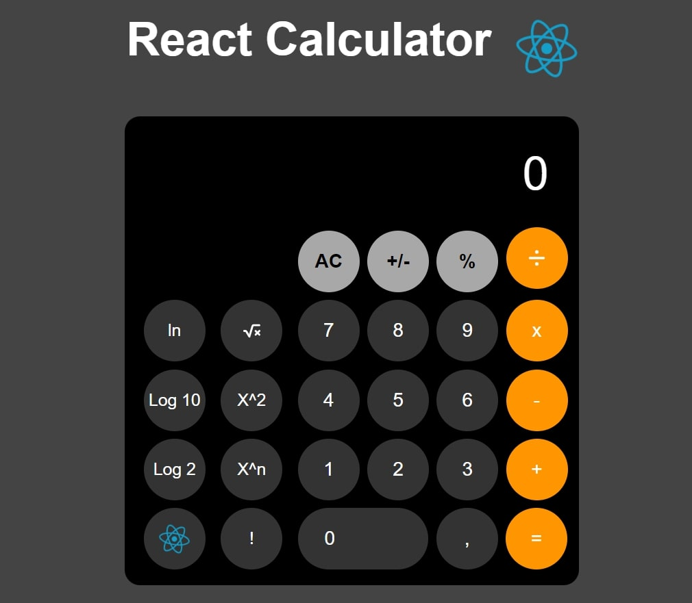

<h1 align="center"> React Calculator </h1>

  <a href="#-tecnologias">Tecnologias</a>&nbsp;&nbsp;&nbsp;|&nbsp;&nbsp;&nbsp;
  <a href="#-projeto">Projeto</a>&nbsp;&nbsp;&nbsp;|&nbsp;&nbsp;&nbsp;
  <a href="#-layout">Layout</a>&nbsp;&nbsp;&nbsp;|&nbsp;&nbsp;&nbsp;

 

  

## 🚀 Tecnologias

Esse projeto foi desenvolvido com as seguintes tecnologias:

- React js
- Javascript
- React Hooks
- Styled Components
- CSS
- Git e Github
- Figma

## 💻 Projeto

Uma Calculadora Ciêntifica feita em React !!

- [Acesse o projeto finalizado, online](https://maykbrito.github.io/devlinks)
